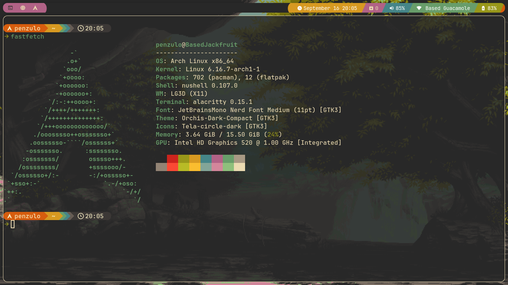
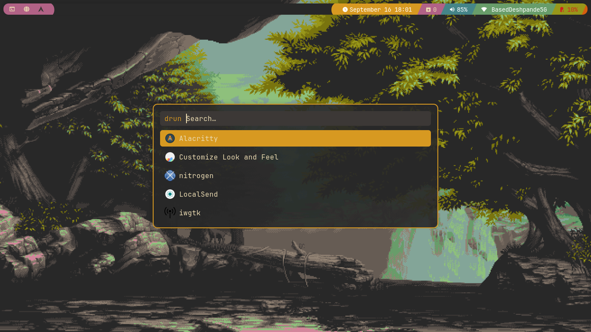
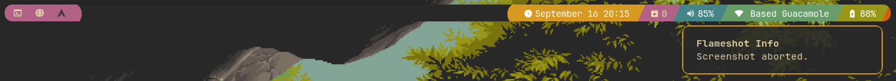
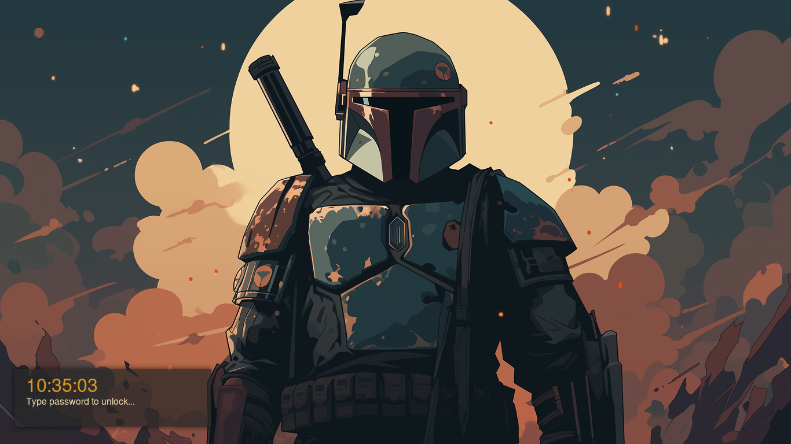

# 🖥️ My Arch Linux Rice

[](https://archlinux.org)
[](https://qtile.org)
[](https://github.com/morhetz/gruvbox)
[](LICENSE)


A clean, minimal and cohesive desktop setup built on **Qtile** with a **Gruvbox Dark** color scheme.  
This configuration is tuned for a smooth workflow, minimal distractions, and consistent aesthetics.

---

## ✨ Gallery

| Clean Desktop | Application Launcher (Rofi) |
| :---: | :---: |
|  |  |

| Notifications (Dunst) | Lock Screen |
| :---: | :---: |
|  |  |

---

## 🔧 The Stack

This setup is built on a stack of lightweight, configurable, and powerful tools.

### ⚙️ Core System
* **OS** → **Arch Linux**
* **Window Manager** → **Qtile**
* **Compositor** → **Picom**
* **Display Manager** → **LightDM**
* **Shell** → **Nushell**
* **Terminal** → **Alacritty**(main) + **Kitty**(secondary)

### 🎨 Theming & UI
* **Color Scheme** → **Gruvbox Dark**
* **Font** → **JetBrainsMono Nerd Font**(Terminal) + **Inter Display**(System)
* **Application Launcher** → **Rofi**
* **Notifications** → **Dunst**
* **GTK & Icons** → **Gruvbox-Dark-Medium & Tela Circle**

### 🛠️ Key Applications
* **Audio** → **PipeWire**
* **File Managers** → **Yazi (CLI) + Thunar (GUI)**
* **Password Management** → **pass**
* **Screenshots** → **Flameshot**

---

## 💡 Notes

- Configs are modular and easy to extend.
- Gruvbox Dark is applied universally for consistency.
- Power menu, scratchpads, and more are integrated via Rofi and Qtile.
- All fonts and icons are patched and themed for Nerd Font compatibility.

---

## 📥 Installation (Optional)

> ⚠️ Not automated yet — configs are meant to be referenced manually.

```bash
git clone https://github.com/penzulo/dotfiles.git ~/.dotfiles
cd ~/.dotfiles
# Copy configs manually or with a script
```

## 📝 License
MIT — feel free to reuse or adapt.
