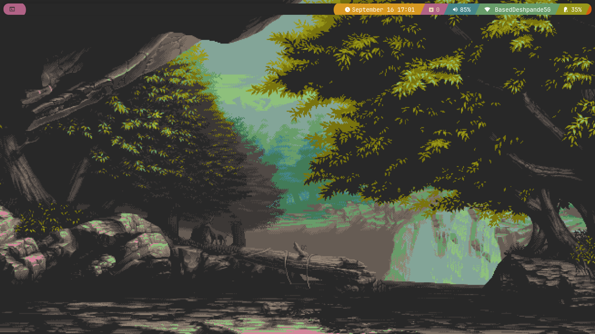
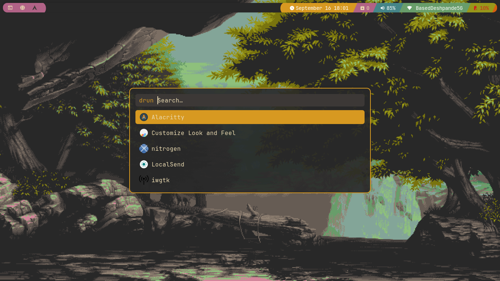
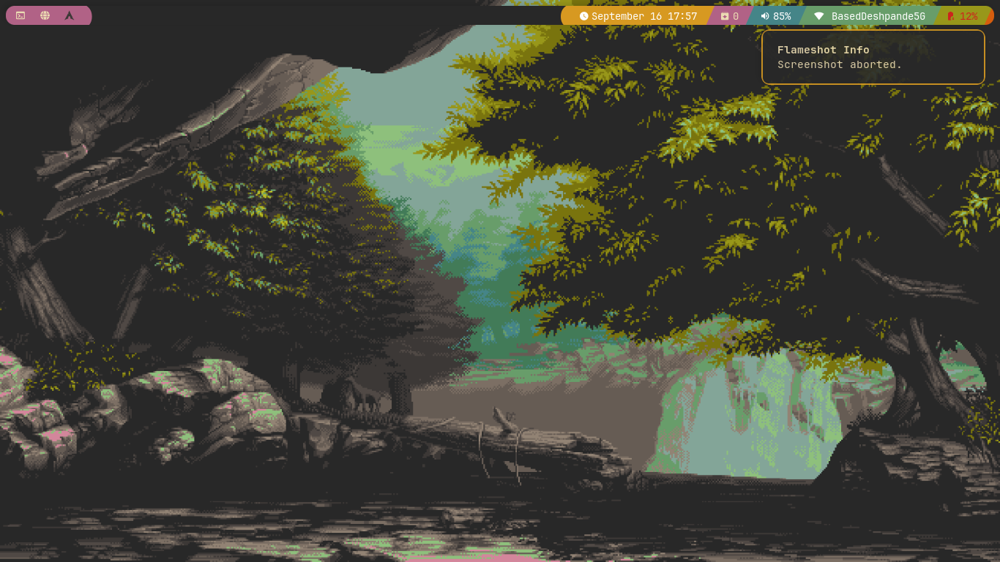
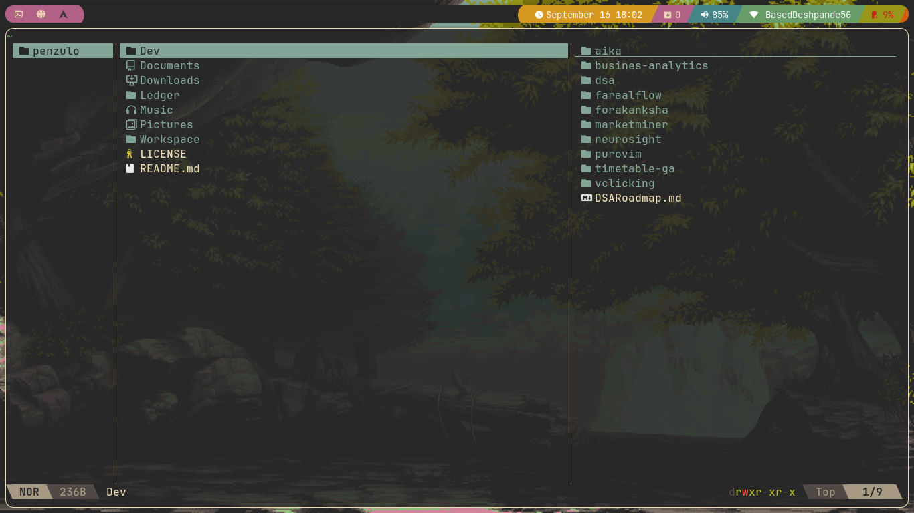

# 🖥️ My Arch Linux Rice

[](https://archlinux.org)
[](https://qtile.org)
[](https://github.com/morhetz/gruvbox)
[](LICENSE)


A clean, minimal and cohesive desktop setup built on **Qtile** with a **Gruvbox Dark** color scheme.  
This configuration is tuned for a smooth workflow, minimal distractions, and consistent aesthetics.

---

## ⚙️ System Overview

| Component            | Details                          |
|-----------------------|--------------------------------|
| **OS**               | Arch Linux                       |
| **Display Server**   | X11                              |
| **Window Manager**   | Qtile (powerline bar, gaps, rounded corners) |
| **Compositor**       | Picom (blur, transparency, rounded corners) |
| **Display Manager**  | LightDM (Slick-greeter)           |
| **Lockscreen**        | Betterlockscreen (Gruvbox wallpapers) |
| **Shell**             | Nushell (primary) + Bash         |
| **Prompt**             | Starship                         |

---

## 🎨 Theming

| Type           | Choice                     |
|----------------|------------------------------|
| **Color Scheme** | Gruvbox Dark                |
| **Font**           | JetBrainsMono Nerd Font       |
| **GTK Theme**      | Orchis-Dark-Compact            |
| **Icon Theme**     | Tela Circle Dark               |
| **Terminal**       | Alacritty                      |
| **Application Launcher** | Rofi (apps, file search, power menu, pass) |
| **Notifications**  | Dunst (Gruvbox styled, transparent) |

---

## 🛠 Core Tools

| Category            | Tool                        |
|----------------------|----------------------------|
| **Audio**            | PipeWire + `wpctl`          |
| **Network**           | iwgtk                       |
| **Screenshots**       | Flameshot                   |
| **File Managers**      | Yazi (CLI) + Thunar (GUI)     |
| **Password Management** | pass (with Rofi integration) |
| **Email** | neomutt |
| **Package Management** | pacman + yay + flatpak |

---

## 📸 Screenshots

| Desktop | Rofi | Dunst | Yazi |
|---------|------|-------|------|
|  |  |  |  |

---

## 💡 Notes

- Configs are modular and easy to extend.
- Gruvbox Dark is applied universally for consistency.
- Power menu, scratchpads, and more are integrated via Rofi and Qtile.
- All fonts and icons are patched and themed for Nerd Font compatibility.

---

## 📥 Installation (Optional)

> ⚠️ Not automated yet — configs are meant to be referenced manually.

```bash
git clone https://github.com/<your-username>/dotfiles.git ~/.dotfiles
cd ~/.dotfiles
# Copy configs manually or with a script
```

## 📝 License
MIT — feel free to reuse or adapt.
